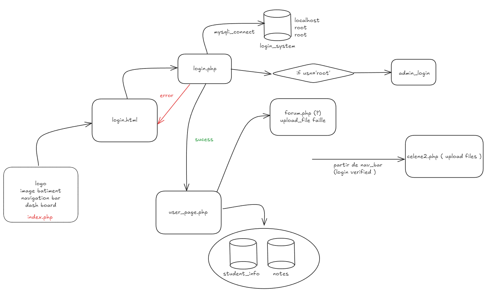

# Projet Securite

## Construction d'un site web:

Tout developper le site, on utilise le framework php.  
Pour developper, on utilise 3 component:
- php: version 7.4 - apache inclus
- mysql
- phpmyadmin

Tout se compose dans le fichier `docker-compose.yml`.  
Pour installer: `docker-compose up -d`

*Vous me dit si vous avez besoin plus comment configurer le serveur*

Pour lancer: Ouvrez le browser
- `localhost` pour le site web
- `localhost:8080` pour phpmyadmin ( user: `user`, password: `test` )

## Structure du site:


- components:
    - public:
        - navbar.php
        - dashboard.php
    - private:
        - modifier.php
        - ...
- pages:
    - public:
        - home.php
        - login.php
        - register.php
    - private:
        - dashboard.php
        - profile.php
        - ...
- controller:
    - login.php
    - register.php
    - logout.php

    
- lib
- model
- view


## Base de donnees:

Some init SQL:
```sql
CREATE DATABASE IF NOT EXISTS insa_db;

USE insa_db;

CREATE TABLE IF NOT EXISTS Users (
    id INT AUTO_INCREMENT PRIMARY KEY,
    email VARCHAR(255) UNIQUE NOT NULL,
    password VARCHAR(255) NOT NULL,
    nom VARCHAR(255) NOT NULL,
    prenom VARCHAR(255) NOT NULL,
    sexe ENUM('M', 'F') NOT NULL,
    date_naissance DATE NOT NULL,
    adresse VARCHAR(255) NOT NULL,
    telephone VARCHAR(255) NOT NULL,
    image_path VARCHAR(255),
    role ENUM('Student', "Professor") NOT NULL
);

CREATE TABLE IF NOT EXISTS Students (
    stu_id INT PRIMARY KEY,
    departement ENUM("STI", "MRI") NOT NULL,
    promo ENUM("1A", "2A", "3A", "4A", "5A") NOT NULL,
    group_td ENUM("TD1", "TD2", "TD3", "Big Data", "Securite", "Mobilite", "ASL", "4AS", "2SU") NOT NULL,
    group_tp ENUM("TP1", "TP2", "TP3") NOT NULL,
    group_anglais ENUM("Anglais1", "Anglais2", "Anglais3", "Anglais4", "Anglais5", "Anglais6" ) NOT NULL,
    FOREIGN KEY (stu_id) REFERENCES Users(id)
);

CREATE TABLE IF NOT EXISTS Professeurs (
    prof_id INT PRIMARY KEY,
    FOREIGN KEY (prof_id) REFERENCES Users(id),
    departement ENUM("STI", "MRI") NOT NULL
);

CREATE TABLE IF NOT EXISTS Matiere (
    matier_id INT PRIMARY KEY AUTO_INCREMENT,
    nom VARCHAR(255) NOT NULL
);


-- Fact table

CREATE TABLE IF NOT EXISTS Cours_info (
    stu_id INT,
    matier_id INT,
    note INT,
    FOREIGN KEY (stu_id) REFERENCES Students(stu_id),
    FOREIGN KEY (matier_id) REFERENCES Matiere(matier_id),
    PRIMARY KEY(stu_id, matier_id)
);

CREATE TABLE IF NOT EXISTS Classes(
    prof_id INT,
    matier_id INT,
    FOREIGN KEY (prof_id) REFERENCES Professeurs(prof_id),
    FOREIGN KEY (matier_id) REFERENCES Matiere(matier_id),
    PRIMARY KEY(prof_id, matier_id)
);

CREATE TABLE IF NOT EXISTS Documents(
    doc_id INT AUTO_INCREMENT PRIMARY KEY,
    author_id INT,
    mattier_id INT,
    title VARCHAR(255) NOT NULL,
    name VARCHAR(255) NOT NULL,
    section ENUM("Cours", "TD", "TP", "Examen", "Correction"),
    FOREIGN KEY (author_id) REFERENCES Users(id),
    FOREIGN KEY (mattier_id) REFERENCES Matiere(matier_id),
    path VARCHAR(255) NOT NULL

);


CREATE TABLE IF NOT EXISTS Annoncement(
    annon_id INT AUTO_INCREMENT PRIMARY KEY,
    author_id INT,
    matier_id INT,
    title VARCHAR(255) NOT NULL,
    content TEXT NOT NULL,
    date DATE NOT NULL,
    FOREIGN KEY (author_id) REFERENCES Professeurs(prof_id),
    FOREIGN KEY (matier_id) REFERENCES Matiere(matier_id)
);

CREATE TABLE IF NOT EXISTS Comments(
    comment_id INT AUTO_INCREMENT PRIMARY KEY,
    author_id INT,
    annon_id INT,
    content TEXT NOT NULL,
    date DATE NOT NULL,
    FOREIGN KEY (author_id) REFERENCES Users(id),
    FOREIGN KEY (annon_id) REFERENCES Annoncement(annon_id)
);

CREATE TABLE IF NOT EXISTS Mails(
    mail_id INT AUTO_INCREMENT PRIMARY KEY,
    sender_id INT,
    receiver_id INT,
    title VARCHAR(255) NOT NULL,
    content TEXT NOT NULL,
    date DATE NOT NULL,
    FOREIGN KEY (sender_id) REFERENCES Users(id),
    FOREIGN KEY (receiver_id) REFERENCES Users(id)
);

CREATE TABLE IF NOT EXISTS Posts(
    post_id INT AUTO_INCREMENT PRIMARY KEY,
    author_id INT,
    title VARCHAR(255) NOT NULL,
    content TEXT NOT NULL,
    image_path VARCHAR(255),
    date DATE NOT NULL,
    FOREIGN KEY (author_id) REFERENCES Users(id)
);

CREATE TABLE IF NOT EXISTS Cmt_post(
    cmt_id INT AUTO_INCREMENT PRIMARY KEY,
    author_id INT,
    post_id INT,
    content TEXT NOT NULL,
    date DATE NOT NULL,
    FOREIGN KEY (author_id) REFERENCES Users(id),
    FOREIGN KEY (post_id) REFERENCES Posts(post_id)
);

```

Upload some data into the database
```sql

DELIMITER //
CREATE PROCEDURE insert_student(
    IN var_email VARCHAR(255),
    IN var_password VARCHAR(255),
    IN var_nom VARCHAR(255),
    IN var_prenom VARCHAR(255),
    IN var_sexe ENUM('M', 'F'),
    IN var_date_naissance DATE,
    IN var_adresse VARCHAR(255),
    IN var_telephone VARCHAR(255),
    IN var_image_path VARCHAR(255),
    IN var_departement ENUM('STI', 'MRI'),
    IN var_promo ENUM('1A', '2A', '3A', '4A', '5A')
)
BEGIN
    DECLARE var_stu_id INT;
    INSERT INTO Users (email, password, nom, prenom, sexe, date_naissance, adresse, telephone, image_path, role) 
    VALUES (var_email, var_password, var_nom, var_prenom, var_sexe, var_date_naissance, var_adresse, var_telephone, var_image_path, 'Student');
    SET var_stu_id = (SELECT id FROM Users WHERE email = var_email);
    INSERT INTO Students (stu_id, departement) VALUES
    (var_stu_id, var_departement);
END //
DELIMITER ;

DELIMITER //
CREATE PROCEDURE insert_professor(
    IN var_email VARCHAR(255),
    IN var_password VARCHAR(255),
    IN var_nom VARCHAR(255),
    IN var_prenom VARCHAR(255),
    IN var_sexe ENUM('M', 'F'),
    IN var_date_naissance DATE,
    IN var_adresse VARCHAR(255),
    IN var_telephone VARCHAR(255),
    IN var_image_path VARCHAR(255),
    IN var_departement ENUM('STI', 'MRI')
)
BEGIN
    DECLARE var_prof_id INT;
    INSERT INTO Users (email, password, nom, prenom, sexe, date_naissance, adresse, telephone, image_path, role) 
    VALUES (var_email, var_password, var_nom, var_prenom, var_sexe, var_date_naissance, var_adresse, var_telephone, var_image_path, 'Professor');
    SET var_prof_id = (SELECT id FROM Users WHERE email = var_email);
    INSERT INTO Professeurs (prof_id, departement) VALUES
    (var_prof_id, var_departement);
END //
DELIMITER ;

DELIMITER //
CREATE PROCEDURE insert_matiere(
    IN var_nom VARCHAR(255)
)
BEGIN
    INSERT INTO Matiere (nom) VALUES (var_nom);
END //
DELIMITER ;


DELIMITER //
CREATE PROCEDURE login(
    IN var_email VARCHAR(255),
    IN var_password VARCHAR(255)
)
BEGIN
    SELECT * FROM Users WHERE email = var_email AND password = var_password LIMIT 1;
END //
DELIMITER ;


```
    
```sql
CALL insert_student(
    'xuan_phuc.pham@insa-cvl.fr',
    '123456',
    'Pham',
    'Xuan Phuc',
    'M',
    '1998-12-12',
    '1 rue de la paix',
    '0123456789',
    'Pham_Xuan_Phuc.img',
    'STI',
    '4A',
    'TD1',
    'TP1',
    'Anglais1'
);
CALL insert_student(
    'yoann.constans@insa-cvl.fr',
    '123456',
    'Constans',
    'Yoann',
    'M',
    '1998-12-12',
    '1 rue de la paix',
    '0123456789',
    'Constans_Yoann.img',
    'STI',
    '4A'
)
CALL insert_professor(
    'jeremy.briffaut@insa-cvl.fr',
    '123456',
    'Briffaut',
    'Jeremy',
    'M',
    '1998-12-12',
    '1 rue de la paix',
    '0123456789',
    'Briffaut_Jeremy.img',
    'STI'
);

CALL init_groupes();


CALL insert_matiere('Securite Systeme');
CALL insert_matiere('Java');
CALL insert_matiere('Programmation Web');


```
